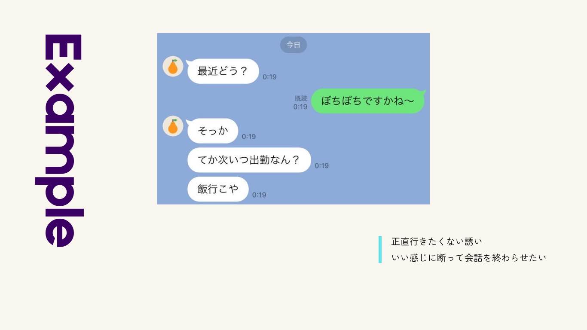
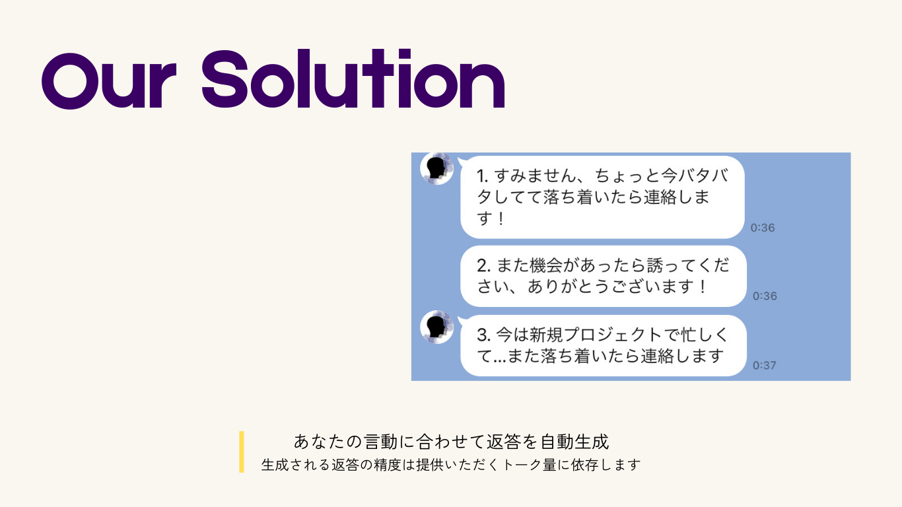

# alter-ego

Alter-rgoは会話に疲れたすべての現代人に捧げる究極のLINEbotです




下記のQRからLINEbotを友達登録して利用してみましょう


## ディレクトリ構成

```plaintext
.
├── backend         # 中間層
├── cdk             # cdk
├── line            # LINE関連
│   ├── backend     # Messaging API and LIFF用backend
│   └── liff        # LIFFアプリ
├── llm             # 言語処理
└── proto           # schema
```

## Docker立ち上げ

```sh
docker compose up --build # (本番環境では、docker compose -f docker-compose.yml up --build)
docker compose -f nginx/docker-compose.yml up --build
```

各README.mdを参照。

## ローカル環境を公開

ngrokがおすすめ。下記のサイトが参考になる。
[Node.js & TypeScriptでLINEBot入門（1）：チャットボット開発の流れと実践方法 | Go-Tech Blog](https://go-tech.blog/nodejs/line-chat-bot/)

```sh
ngrok http 3000
```
